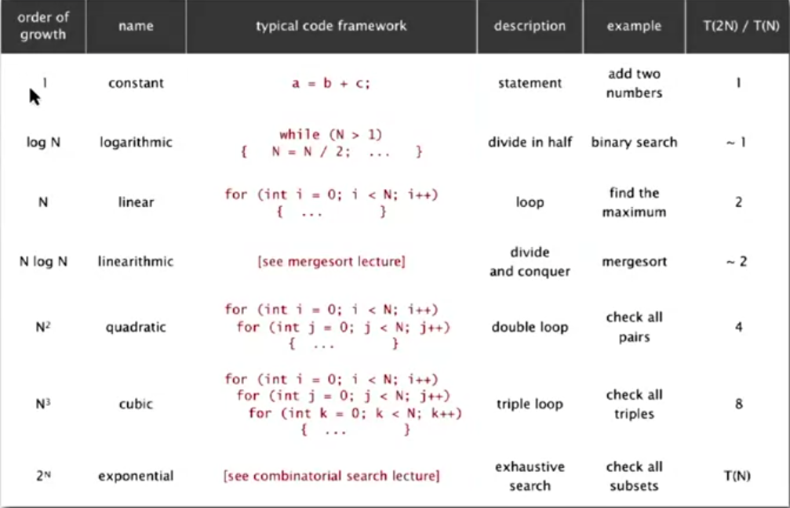

# Analysis of Algorithms

* System independent effects
    * Algorithm
    * Input data
* System dependent effects
    * Hardware (CPU, memory, cache, ...)
    * Software (complier, interpreter, garbage collector, ...)
    * System (operating system, network , other apps, ...)

* Common order-of-growth classifications
