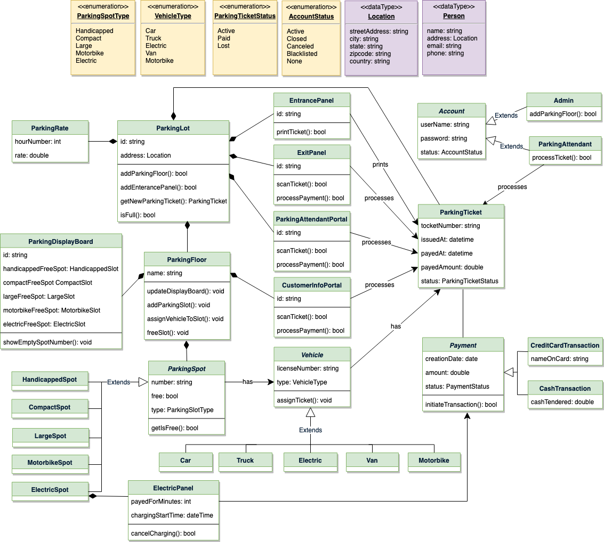
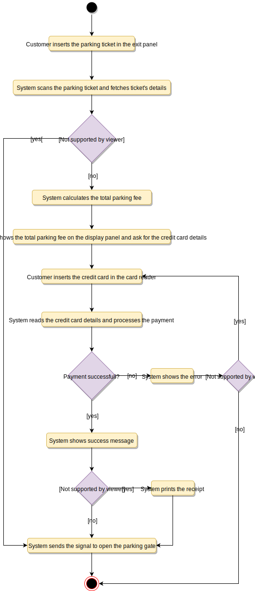

# Parking Lot

Ref: https://www.educative.io/courses/grokking-the-object-oriented-design-interview/gxM3gRxmr8Z

1. Clarify system requirements
    * Building
        * Number of floors
        * Number of entry and exit points
        * There are maximum capacity of the parking lot
        * The availability of each type of parking lots should be showed on the parking display board on each floor
        * Types of parking spots for different types of vehicles
    * Customer
    * Money
        * The system should support a per-hour parking fee model
        * Customer can collect a parking ticket from the entry point
        * Customer can pay the parking fee to the parking machines on each floor
        * Customer can pay via cash or credit cards
        * Customer can give the parking ticket to prove they already paid for the parking fee at the exit panels

2. Discuss use cases
    * Main actors
        * Customer: All customers can get a parking ticket and pay for it.
        * Spot Tracking System: To display messages on different info panels, as well as assigning and removing a vehicle from a parking spot.
        * Pay Station: There is 2 machines on each floor to collect parking fees via cash or cradit cards
    * Main use cases
        * Add/Remove/Edit parking floor: To add, remove or modify a parking floor from the system. Each floor can have its own display board to show free parking spots.
        * Add/Remove/Edit parking spot: To add, remove or modify a parking spot on a parking floor.
        * Take ticket: To provide customers with a new parking ticket when entering the parking lot.
        * Scan ticket: To scan a ticket to find out the total charge.
        * Credit card payment: To pay the ticket fee with credit card.
        * Cash payment: To pay the parking ticket through cash.
        * Add/Modify parking rate: To allow admin to add or modify the hourly parking rate.

3. Class diagram
    
    

4. Activity: Customer paying for parking ticket
    
    

5. Code
    * Emuns and data types

            public enum ParkingSpotType {
                HANDICAPPED, COMPACT, LARGE, MOTORBIKE
            }

            public enum VehicleType {
                CAR, TRUCK, VAN, MOTORBIKE
            }

            public class Address {
                private String street;
                private String city;
                private String state;
                private String country;
                private String zipcode;
            }

    * Parking Lot

            public class ParkingLot {
                private String name;
                private Location address;
                private ParkingRate parkingRate;

                private int compactSpotCount;
                // ...
                private final int maxCompactCount;
                // ...

                private HashMap<String, EntrancePanel> entrancePanels;
                private HashMap<String, ExitPanel> exitPanels;
                private HashMap<String, ParkingFloor> parkingFloors;

                // all active parking tickets, identified by their ticketNumber
                private HashMap<String, ParkingTicket> activeTickets;

                // singleton ParkingLot to ensure only one object of ParkingLot in the system,
                // all entrance panels will use this object to create new parking ticket: getNewParkingTicket(),
                // similarly exit panels will also use this object to close parking tickets
                private static ParkingLot parkingLot = null;

                // private constructor to restrict for singleton
                private ParkingLot() {
                    // 1. initialize variables: read name, address and parkingRate from database
                    // 2. initialize parking floors: read the parking floor map from database,
                    //  this map should tell how many parking spots are there on each floor. This
                    //  should also initialize max spot counts too.
                    // 3. initialize parking spot counts by reading all active tickets from database
                    // 4. initialize entrance and exit panels: read from database
                }

                // static method to get the singleton instance of StockExchange
                public static ParkingLot getInstance() {
                    if (parkingLot == null) {
                        parkingLot = new ParkingLot();
                    }
                    return parkingLot;
                }

                // note that the following method is 'synchronized' to allow multiple entrances
                // panels to issue a new parking ticket without interfering with each other
                public synchronized ParkingTicket getNewParkingTicket(Vehicle vehicle) throws ParkingFullException {
                    if (this.isFull(vehicle.getType())) {
                        throw new ParkingFullException();
                    }
                    ParkingTicket ticket = new ParkingTicket();
                    vehicle.assignTicket(ticket);
                    ticket.saveInDB();
                    // if the ticket is successfully saved in the database, we can increment the parking spot count
                    this.incrementSpotCount(vehicle.getType());
                    this.activeTickets.put(ticket.getTicketNumber(), ticket);
                    return ticket;
                }

                public boolean isFull(VehicleType type) {
                    // trucks and vans can only be parked in LargeSpot
                    if (type == VehicleType.Truck || type == VehicleType.Van) {
                        return largeSpotCount >= maxLargeCount;
                    }

                    // motorbikes can only be parked at motorbike spots
                    if (type == VehicleType.Motorbike) {
                        return motorbikeSpotCount >= maxMotorbikeCount;
                    }

                    // cars can be parked at compact or large spots
                    if (type == VehicleType.Car) {
                        return (compactSpotCount + largeSpotCount) >= (maxCompactCount + maxLargeCount);
                    }

                    // electric car can be parked at compact, large or electric spots
                    return (compactSpotCount + largeSpotCount + electricSpotCount) >= (maxCompactCount + maxLargeCount + maxElectricCount);
                }

                // increment the parking spot count based on the vehicle type
                private boolean incrementSpotCount(VehicleType type) {
                    if (type == VehicleType.Truck || type == VehicleType.Van) {
                        largeSpotCount++;
                    } else if (type == VehicleType.Motorbike) {
                        motorbikeSpotCount++;
                    } else if (type == VehicleType.Car) {
                        if (compactSpotCount < maxCompactCount) {
                            compactSpotCount++;
                        } else {
                            largeSpotCount++;
                        }
                    } else { // electric car
                        if (electricSpotCount < maxElectricCount) {
                            electricSpotCount++;
                        } else if (compactSpotCount < maxCompactCount) {
                            compactSpotCount++;
                        } else {
                            largeSpotCount++;
                        }
                    }
                }

                public boolean isFull() {
                    for (String key : parkingFloors.keySet()) {
                        if (!parkingFloors.get(key).isFull()) {
                            return false;
                        }
                    }
                    return true;
                }

                public void addParkingFloor(ParkingFloor floor) {
                    // store in database
                }

                public void addEntrancePanel(EntrancePanel entrancePanel) {
                    // store in database
                }

                public void addExitPanel(ExitPanel exitPanel) {
                    // store in database
                }
            }

    * Parking Floor: This class encapsulates a parking floor

            public class ParkingFloor {
                private String name;
                private HashMap<String, HandicappedSpot> handicappedSpots;
                // and othertypes of spots
                private HashMap<String, PayStation> payStations;
                private DisplayBoard diaplayBoard;

                public ParkingFloor(String name) {
                    this.name = name;
                }

                public void addSpot(ParkingSpot spot) {
                    switch(spot.getType()) {
                        case ParkingSpotType.HANDICAPPED:
                            handicappedSpots.put(spot.getNumber(), spot);
                            break;
                        case ParkingSpotType.COMPACT:
                            compactSpots.put(spot.getNumber(), spot);
                            break;
                        // ...
                        default
                            System.out.println("Wrong parking spot type!");
                    }
                }

                public void assignVehicleToSpot(Vehicle v, ParkingSpot spot) {
                    spot.assignVehicle(v);
                    switch(spot.getType()) {
                        case ParkingSpotType.HANDICAPPED:
                            updateDisplayBoardForHandicapped(spot);
                            break;
                        // ...
                        default:
                            System.out.println("wrong parking spot type!");
                    }
                }

                private void updateDisplayBoardForHandicapped(ParkingSpot spot) {
                    if (this.displayBoard.getHandicappedFreeSpot().getNumber() == spot.getNumber()) {
                        // find another free handicapped parking and assign to displayBoard
                        for (String key : handicappedSpots.keySet()) {
                            if (handicappedSpots.get(key).isFree()) {
                                this.displayBoard.setHandicappedFreeSpot(handicappedSpots.get(key));
                            }
                        }
                        this.displayBoard.showEmptySpotNumber();
                    }
                }

                public void freeSpot(ParkingSpot spot) {
                    spot.removeVehicle();
                    switch (spot.getType()) {
                        case ParkingSpotType.HANDICAPPED:
                            freeHandicappedSpotCount++;
                            break;
                        // ...
                        default:
                            print("Wrong parking spot type!");
                    }
                }
            }

    * Diaplay Board

            public class ParkingDisplayBoard {
                private String id;
                private HandicappedSpot handicappedFreeSpot;
                private CompactSpot compactFreeSpot;
                private LargeSpot largeFreeSpot;
                private MotorbikeSpot motorbikeFreeSpot;
                private ElectricSpot electricFreeSpot;

                public void showEmptySpotNumber() {
                    String message = "";
                    if(handicappedFreeSpot.IsFree()){
                        message += "Free Handicapped: " + handicappedFreeSpot.getNumber();
                    } else {
                        message += "Handicapped is full";
                    }
                    message += System.lineSeparator();

                    // ...
                    Show(message);
                }
            }

    * Pay Station

    * Parking Spot

            public abstract class ParkingSpot {
                private String parkingSpotNumber;
                private boolean free;
                private final ParkingSpotType type;
                private Vehicle vehicle;

                public parkingSpot(ParkingSpotType type) {
                    this.type = type;
                    free = true;
                }

                public boolean isFree() {
                    return this.free;
                }

                public assignVehicle(Vehicle v) {
                    this.vehicle = v;
                    free = false;
                }

                public removeVehicle() {
                    this.vehicle = null;
                    free = true;
                }
            }

            public class HandicappedSpot extends ParkingSpot {
                public HandicappedSpot() {
                    super(ParkingSpotType.HANDICAPPED);
                }
            }
            // and others ...

    * Vehicle

            public abstract class Vehicle {
                private String licenseNumber;
                private final VehicleType type;
                private ParkingTicket ticket;

                Vehicle(VehicleType type) {
                    this.type = type;
                }

                public void assignTicket(ParkingTicket ticket) {
                    this.ticket = ticket;
                }
            }

            public class Car extends Vehicle {
                public Car() {
                    super(VehicleType.CAR);
                }
            }
            // and others ...

    * ParkingTicket

    * Payment
