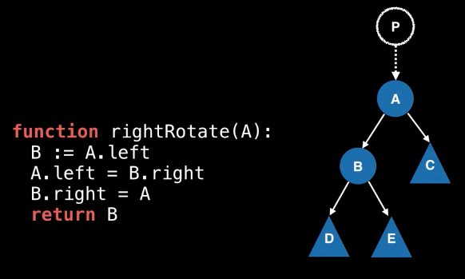
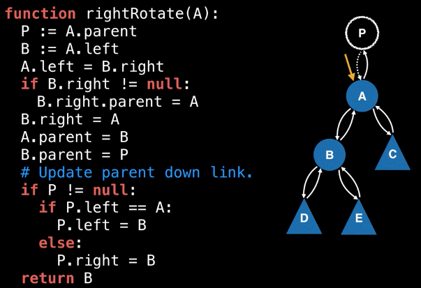

# Balanced Binary Search Tree (BBST)

* A balanced binary search tree is a self-balancing binary search tree. This type of tree will adjust itself in order to maintain a low (logarithmtic) height allowing for faster operations such as insertions and deletions.

* An AVL tree is one of many types of BBSTs which allow for logarithmic O(log(n)) insertion, deletion and search operations.

* Othet types of BBSTs: 2-3 tree, AA tree, scapegoat tree, red-black tree and so on.

### Complexity Analysis

        +-------------+-----------+-----------+
        | Operation   | Avg       | Worst     |
        +-------------+-----------+-----------+
        | Insert      | O(log(n)) | O(log(n)) |
        +-------------+-----------+-----------+
        | Delete      | O(log(n)) | O(log(n)) |
        +-------------+-----------+-----------+
        | Remove      | O(log(n)) | O(log(n)) |
        +-------------+-----------+-----------+
        | Search      | O(log(n)) | O(log(n)) |
        +-------------+-----------+-----------+

### Tree Rotations
* The secret ingredient to most BBST algorithms is the clever usage of a **tree invariant** and **tree rotations**.
* A tree invariant is a property/rule you impose on your tree that is must meet after every operation. To ensure that the invariant is always satisfied a series of tree rotations are always applied.
* Right rotation
    * P might or might not exist.
    *             
    * 

### AVL Tree
* The property which keeps an AVL tree balanced is called the **Balanced Factor (BF)**. The invariant in the AVL tree which forces it to remain balanced is the requirement that the balance factor is always either -1, 0 or +1.

        BF(node) = H(node.right) - H(node.left)

        // Where H(x) is the height of node x.

* Node information to store:
    * The actual comparable value
    * A value storing this node's BF
    * The height of this node in the tree
    * Pointers to the left/right child nodes

* If the BF of one node is not in {-1, 0, 1}, we should handle it by tree rotation. Here comes 4 situations of tree rotation (think of 3 nodes):
    1. Left left case -> right rotation
    2. Left right case -> left rotation and right rotation
    3. Right right case -> left rotation
    4. Right left case -> right rotation and left rotation

#### AVL Tree Insertion

        // Public facing insert method.
        // Returns true on successful insert and false otherwise.
        function insert(value):
            if value == null:
                return false

            // Only insert unique values
            if !contains(root, value):
                root = insert(root, value)
                nodeCount = nodeCount + 1
                return true

            // Value already exists in tree.
            return false

        // Private
        function insert(node, value):
            if node == null:
                return Node(value)

            // Invoke the comparator function in whatever
            // programming language you're using.
            cmp := compare(value, node.value)

            if cmp < 0:
                node.left = insert(node.left, value)
            else:
                node.right = insert(node.right, value)

            // Update balance factor and height values.
            update(node)

            // Rebalance tree
            return balance(node)

        // Update balance factor and height values
        function update(node):

            // Variables for left/right subtree heights
            lh := -1
            rh := -1
            if node.left != null:
                lh = node.left.height
            if node.right != null:
                rh = node.right.height

            // Update this.node's height
            node.height = 1 + max(lh, rh)

            // Update balance factor
            node.bf = rh - lh

        function balance(node):
            // Left heavy subtree
            if node.bf == -2:
                if node.left.bf <= 0:
                    return leftLeftCase(node)
                else:
                    return leftRightCase(node)

            // Right heavy subtree
            else if node.bf == 2:
                if node.right.bf >= 0:
                    return rightRightCase(node)
                else:
                    return rightLeftCase(node)

            // Node has balance factor of -1, 0 or 1
            // which we do not need to balance.
            return node

        function leftLeftCase(node):
            return rightRotate(node)

        function leftRightCase(node):
            node.left = leftRotate(node.left)
            return leftLeftCase(node)

        function rightRightCase(node):
            return leftRotate(node)

        function rightLeftCase(node):
            node.right = rightRotate(node.right)
            return rightRightCase(node)      
            

        function rightRotate(A):
            B := A.left
            A.left = B.right

            // After rotation update balance
            // factor and height values.
            update(A)
            update(B)
            return B

#### AVL Tree Removal
* It's like removing elements from the Binary Search Tree:
    1. Find the element
        1. Hit null -> the value does not exist
        2. Comparator = 0 -> found it
        3. Comparator < 0 -> go to the left subtree
        4. Comparator > 0 -> go to the right subtree

    2. Replace the node with its successor (4 cases:
        1. Leaf node
        2. Has only right subtree: The successor of the node will be the immediate node down from the right subtree 
        3. Has only left subtree: The successor of the node will be the immediate node down from the left subtree
        4. Has both left and right subtree: The successor can be either be the largest value in the left subtree or the smallest value in the right subtree

* Augmenting BST removal algorithm for AVL tree

        function remove(node, value):
            ...
            // Code for BST item removal here
            ...

            // Update balance factor
            update(node)

            // Rebalance tree
            return balance(node)
