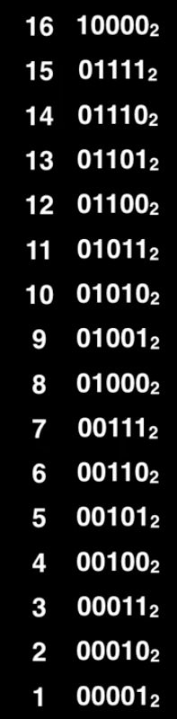
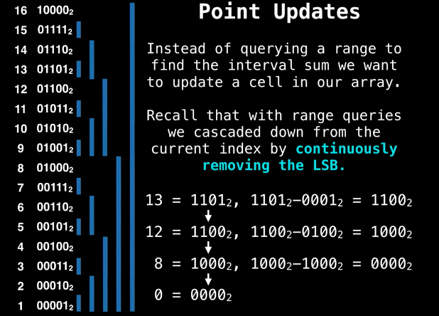
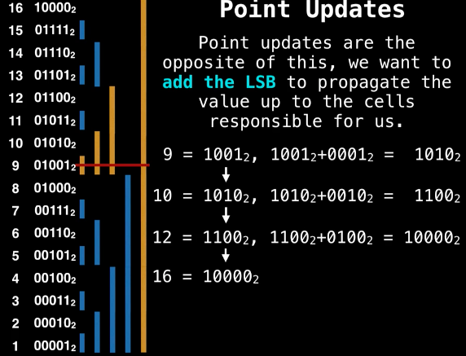

# Binary Indexed Tree (Fenwick Tree)

A Fenwick tree is a data structure that support sum range queries as well as setting values in a static array and getting the value of the prefix sum up some index efficiently.

* LSB, Least Siginificant Bit (最低有效位): 二進制中最小的單位，即LSB是一個二進位數字中的第0位
* The position of the LSB determines the range of responsibility that cell has (to the cells below itself).
    * Index 12 in binary is 1**1**00. LSB is at position 3, so this index is responsible for 2^(3-1) = 4 cells below itself.
    * Index 10 in binary is 10**1**0. LSB is at position 2, so this index is responsible for 2^(2-1) = 2 cells below itself.

* Range query algorithm

        function prefixSum(i):
            sum = 0
            while i != 0:
                sum += tree[i]
                i -= LSB(i)
            return sum

        function rangeQuery(i, j):
            return prefixSum(j) - prefixSum(i-1)

* Point update algorithm (to update the cell at index i in a Fenwick tree of size N)
    
        function add(i, N):
            where i < N:
                tree[i] += x
                i += LSB(i)

* Construction algorithm

        //Make sure values are 1-based
        function construct(values):
            N = length(values)

            //Clone the values array since we're doing in place operations
            tree = deepCopy(values)

            for i = 1, 2, 3, ..., N:
                j = i + LSB(i)
                if j < N;
                    tree[j] += tree[i]
            return tree

    * The array containing the contents of the Fenwick tree makes use of the entry at the 1th index. Since zero has no least significant bit we make Fenwick trees 1 based instead of 0 based.

