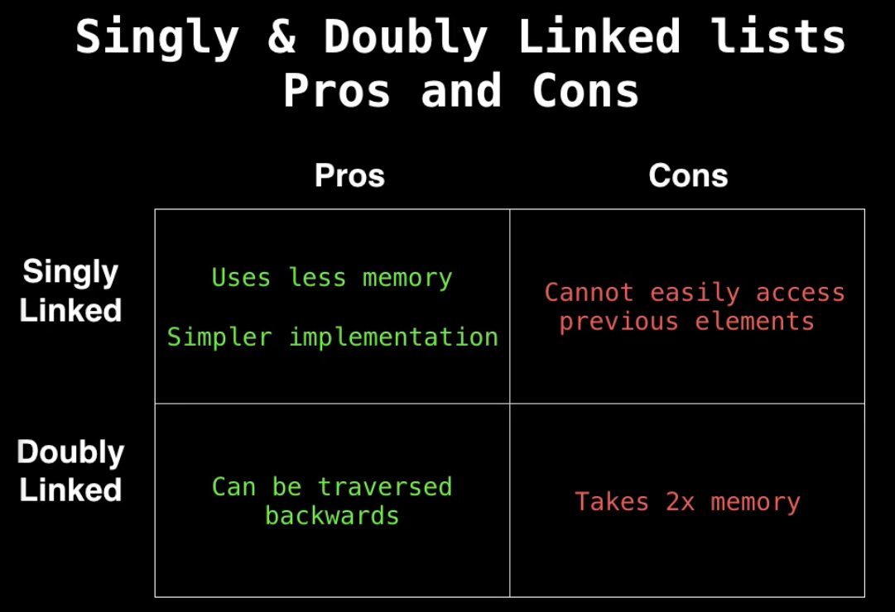

# Linked List

One of the most used data structure!

### Introduction
* Definition: A linked list is sequential list of nodes that hold data which point to other nodes also containing data.

* Use
    * Queue and Stack implementation
    * Hashable implemention
    * Adjacency lists for graph
    * Circular lists
    * Modeling real world objects (e.g. trains)

* Terminology
    * Node: An object containing data and pointer(s)
    * Head
    * Tail
    * Pointer: Reference to another node

* Singly List & Doubly List
    * Singly linked lists only hold a referenceo the next node.
    * With doubly linked lists each node holds to the next and previous node.
    * 

### Complexity Analysis

                           +-----------------+
                           | Singly | Doubly |
        +------------------+-----------------+
        | Search           | O(n)   | O(n)   |
        +------------------+--------+--------+
        | Insert at head   | O(1)   | O(1)   |
        +------------------+--------|--------+
        | Insert at tail   | O(1)   | O(1)   |
        +------------------+--------+--------+
        | Remove at head   | O(1)   | O(1)   |
        +------------------+--------+--------+
        | Remove at tail   | O(n)!! | O(1)   |
        +------------------+--------+--------+
        | Remove in middle | O(n)   | O(n)   |
        +------------------+--------+--------+

### Code Implemention (Doubly List) 
-> [link](src/DoublyLinkedList.java)

        public class DoublyLinkedList<T> implements Iterable<T> {...}

* Every class that implements Iterable interface appropriately, can be used in the enhanced For loop (for-each loop). The need to implement the Iterator interface arises while designing custom data structures.

        for(Item item: customDataStructure) {
            // do stuff
        }

* @Override could be considered as a test. If you don't implement or overwrite the class from superclass, Java will return error message. Also, Error message will show up when the superclass is deleted.

### Related Leetcode Problems
* [Easy]  21.
* [Easy]
* [Easy]
* [Easy]
* [Easy]
