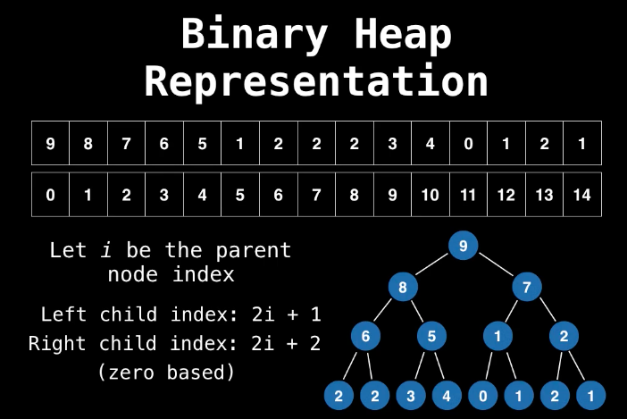

# Priority Queues (PQ) and Binary Heaps

* **A PQ is an Abstract Data Type (ADT)** that operates similar to a normal queue except that each element has a certain priority. The priority of the elements in the PQ determines the order in which elements are removed from PQ.

* PQ only supports comparable data.

* Use: Anytime you need to dynamically fetch the "next best" or "next worse" element

### What is a Heap?

* **A Heap is a tree based data structure** that satisfies the tree invariant (also called heap property): The value of the parent node is always greater than or equal to the value of the child node for all nodes. (Max Heap) Or the other way around, that the value of the parent node if always less than or equal to the value of the child node. (Min Heap) -> binary tree with order

* Sometimes PQ is called a heap as well, but PQ is actually a ADT, which means it could be implemented by some other data structures.

### PQ with binary heap - Complexity Analysis 

        +------------------------+-----------+
        | Binary Heap            |           |
        | construction           | O(n)      |
        +------------------------+-----------+
        | Poll / Remove          | O(log(n)) |
        +------------------------+-----------+
        | Peek                   | O(1)      |
        +------------------------+-----------+
        | Add                    | O(log(n)) |
        +------------------------+-----------+
        | Naive remove           | O(n)      |
        +------------------------+-----------+
        | Advanced remove with   |           |
        | help from a hash table | O(log(n)) |
        +------------------------+-----------+
        | Naive contains         | O(n)      |
        +------------------------+-----------+
        | Contains check with    |           |
        | help from a hash table | O(1)      |
        +------------------------+-----------+

* Using a hash table to help optimize these operations does take up an extra linear space factor and also add some overhead to the binary heap implementation.

### Min Heap and Max Heap

* Often the standard library of most programming language only provide a min PQ, but sometimes we need a max PQ.

* Turning min PQ into max PQ
    * [Change the rule] Let X, Y be the numbers in the min PQ. For a min PQ, if X <= Y then X comes out of the min PQ before Y, so the negation of this is Y <= X then Y comes out before X.
    * [Change the values] An alternative method for numbers is to negate the number as you insert them into the PQ and negate them again when thay are taken out. This has the same effect as negating the comparator.

### Adding elements to a binary heap

* PQ are usually implemented with binary heap since this gives it the best possible time complexity.

* Binary heap representation
    * A binary headp could be represented as an array with the following index rule: 

* The step to insert 1 element to the binary heap
    1. Add it to the last position
    2. If the value of the parent node is bigger than the newly added node, just swap the parent node and the child node (bubble up) (Goal: To make sure tree invairant is satisfied)
    3. Repear step 2 until the value of the parent node is less or equal to the newly added node

### Removing elements from a binary heap

* The step to **poll** element from the binary heap (from the top) - O(log(n))
    1. Swap the root node and the last node
    1. Remove it from the last position
    2. Check the root (swapped) node. If the value of the root node is greater than its child nodes, swap it. (bubble down)

* The step to **remove** the specific element from the binary heap - o(n)
    1. Do linear search for the element to be removed and swap it with the last element
    2. Remove it from the last position
    3. Bubble up or bubble down the swapped node until the heap invariant is satisfied

### Removing elements from a binary heap in O(log(n))

* Idea: Instead doing linear search, we lookup the specific node using a hash table, and change the value (indexed) when swap.
    * We will map 1 value to multiple positions for duplicate values.
    

### Related Leetcode Problems
* [Easy]  1046. [Last Stone Weight](https://leetcode.com/problems/last-stone-weight/)